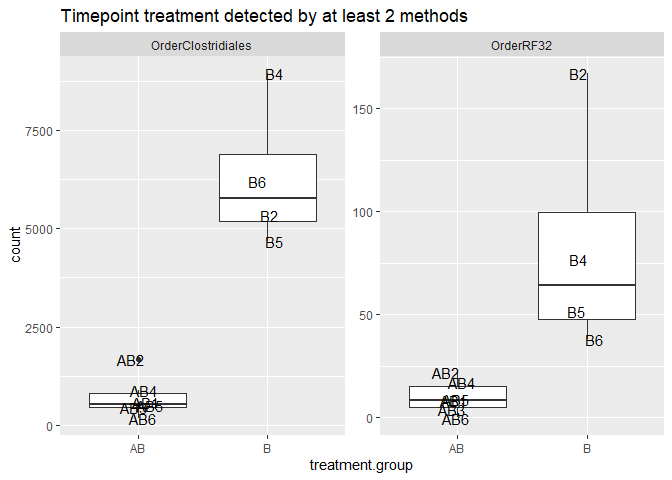
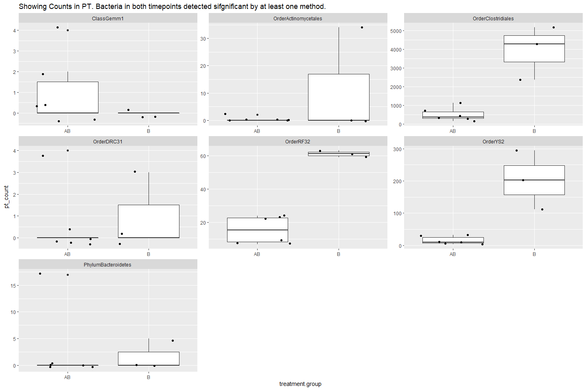

This is based on the tutorial in Orchestrating microbiome analysis (https://microbiome.github.io/OMA/differential-abundance.html).
Read in the needed libraries as well as import data in the right format and make it a Tree Summarized experiment.


```r
knitr::opts_chunk$set(warning = FALSE, message = FALSE) 
```


```r
library(nlme)
library(tidyverse)
library(compositions)
library(mia)
library(patchwork)
library(tidySummarizedExperiment)
library(qiime2R)
library(ANCOMBC)
library(ALDEx2)
library(Maaslin2)
library(knitr)
```

Load in taxonomy(qza) and count file (tsv) and metadata file (txt). (Hidden code, echo = false)


Prepare data and load into a TreeSummarizedExperiment object.

```r
# Add rownames and remove an additional column
rownames(samples) <- samples$sample.id
samples$sample.id <- NULL

# If e.g. samples do not match between colData and counts table, you must order 
# counts based on colData
#if( any( colnames(counts) != rownames(samples) ) ){
#    counts <- counts[ , rownames(samples) ]
#}

# it doesn't match, reordering

rownames(samples)
```

```
##  [1] "AB.1.PT" "AB.2.PT" "AB.3.PT" "AB.4.PT" "AB.5.PT" "AB.6.PT" "AB.1.T" 
##  [8] "AB.2.T"  "AB.3.T"  "AB.4.T"  "AB.5.T"  "AB.6.T"  "B.1.PT"  "B.2.PT" 
## [15] "B.3.PT"  "B.4.PT"  "B.5.PT"  "B.6.PT"  "B.1.T"   "B.2.T"   "B.4.T"  
## [22] "B.5.T"   "B.6.T"
```

```r
colnames(counts)
```

```
##  [1] "AB.1.PT" "AB.1.T"  "AB.2.PT" "AB.2.T"  "AB.3.PT" "AB.3.T"  "AB.4.PT"
##  [8] "AB.4.T"  "AB.5.PT" "AB.5.T"  "AB.6.PT" "AB.6.T"  "B.2.T"   "B.3.PT" 
## [15] "B.4.PT"  "B.4.T"   "B.5.PT"  "B.5.T"   "B.6.PT"  "B.6.T"
```

```r
#subset
samples <- samples[rownames(samples) %in% colnames(counts),]
#reorder
samples <- samples[match(colnames(counts), rownames(samples)),]
#now back to line 84 to check again

# And same with rowData and counts...
if( any( rownames(counts) != rownames(tax) ) ){
    counts <- counts[ rownames(tax), ]
}

counts <- as.matrix(counts)

# And it should be added to a SimpleList
assays <-  SimpleList(counts = counts)

# colData and rowData should be in DataFrame format
colData <- DataFrame(samples)
rowData <- DataFrame(tax)

# Create a TreeSE
tse <- TreeSummarizedExperiment(assays = assays,
                                     colData = samples,
                                     rowData = tax)

tse
```

```
## class: TreeSummarizedExperiment 
## dim: 2348 20 
## metadata(0):
## assays(1): counts
## rownames(2348): d46e2205f0c6ecf67b51f83d111c509c
##   0ebb2cf4a2017aeaefadf9ae5062eb62 ... 69659d7edd60cd37bbdc9e3bb7f77431
##   d85fdf6963c6cd07acb21451a811f84e
## rowData names(7): Kingdom Phylum ... Genus Species
## colnames(20): AB.1.PT AB.1.T ... B.6.PT B.6.T
## colData names(4): sample.type treatment.group subject.id timepoint
## reducedDimNames(0):
## mainExpName: NULL
## altExpNames(0):
## rowLinks: NULL
## rowTree: NULL
## colLinks: NULL
## colTree: NULL
```

```r
head(getTaxonomyLabels(tse))
```

```
## [1] "Family:Enterobacteriaceae" "Family:S24-7"             
## [3] "Family:S24-7_1"            "Family:S24-7_2"           
## [5] "Species:muciniphila"       "Family:S24-7_3"
```

Subsetting to timepoints PT compare AB vs B groups in the pretreatment.

```r
#how many observations per group?
count(as.data.frame(colData(tse)), treatment.group) %>% kable()
```


|treatment.group |  n|
|:---------------|--:|
|AB              | 12|
|B               |  8|

```r
#timepoint 1 and 6 subsetting
tsePT <- tse[ ,colData(tse)$timepoint == "pretreatment"]
tseT <- tse[ ,colData(tse)$timepoint == "treatment"]


#how many observations per group?
count(as.data.frame(colData(tsePT)), treatment.group) %>% kable()
```


|treatment.group |  n|
|:---------------|--:|
|AB              |  6|
|B               |  4|

```r
count(as.data.frame(colData(tseT)), treatment.group) %>% kable()
```


|treatment.group |  n|
|:---------------|--:|
|AB              |  6|
|B               |  4|

```r
# set a seed because some tools can randomly vary and then produce 
# different results:
set.seed(1)

#Prevalence filtering  - removing any ASVs found in fewer than 10% of samples
tse <- subsetByPrevalentTaxa(tse, detection = 0, prevalence = 0.1)
tsePT <- subsetByPrevalentTaxa(tsePT, detection = 0, prevalence = 0.1)
tseT <- subsetByPrevalentTaxa(tseT, detection = 0, prevalence = 0.1)

#agglomerate by rank for which you want to do differential abundance testing
tse_genus <- agglomerateByRank(tse, "Genus")
tsePT_genus <- agglomerateByRank(tsePT, "Genus")
tseT_genus <- agglomerateByRank(tseT, "Genus")
```

Now performing differential aboundance analysis. I will use three methods ALDeX2, Ancom-BC and MaaSlin2 for the comparison (because different methods often produce different results) and compare them. I will use default options for all methods.

ALDEx2

```r
# Pretreatment

x <- aldex.clr(
  reads = assay(tsePT_genus),
  conds = colData(tsePT_genus)$treatment.group, 
  # 128 recommened for ttest, 1000 for rigorous effect size calculation
  mc.samples = 128, 
  denom = "all",
  verbose = FALSE
)
# calculates expected values of the Welch's t-test and Wilcoxon rank test on
# the data returned by aldex.clr
x_tt <- aldex.ttest(
  x, 
  paired.test = FALSE, 
  verbose = FALSE)
# determines the median clr abundance of the feature in all samples and in
# groups, the median difference between the two groups, the median variation
# within each group and the effect size, which is the median of the ratio
# of the between group difference and the larger of the variance within groups
x_effect <- aldex.effect(x, CI = TRUE, verbose = FALSE)
# combine all outputs 
aldex_outPT <- data.frame(x_tt, x_effect)

#creating an MA plot
par(mfrow = c(1, 2))
aldex.plot(
    aldex_outPT, 
    type = "MA", 
    test = "welch", 
    xlab = "Log-ratio abundance",
    ylab = "Difference",
    cutoff = 0.05
  )
aldex.plot(
    aldex_outPT, 
    type = "MW", 
    test = "welch",
    xlab = "Dispersion",
    ylab = "Difference",
    cutoff = 0.05
  )
```

<!-- -->

```r
rownames_to_column(aldex_outPT, "genus") %>%
  filter(wi.eBH <= 0.05)  %>% # here we chose the wilcoxon output rather than tt
  dplyr::select(genus, we.eBH, wi.eBH, effect, overlap) %>%
  kable()
```


|genus                        |    we.eBH|    wi.eBH|    effect|   overlap|
|:----------------------------|---------:|---------:|---------:|---------:|
|Family.Enterobacteriaceae    | 0.0006197| 0.0249766| -6.176953| 0.0002741|
|Family.S24.7                 | 0.0062937| 0.0249766|  4.121899| 0.0002741|
|Genus.Akkermansia            | 0.0112804| 0.0249766|  3.871248| 0.0002741|
|Genus.Prevotella             | 0.0006495| 0.0249766|  5.001740| 0.0002741|
|Genus.Lactobacillus          | 0.0366439| 0.0249766|  2.579157| 0.0039300|
|Family.Rikenellaceae         | 0.0199369| 0.0249766|  3.423476| 0.0002741|
|Genus.Odoribacter            | 0.0116491| 0.0249766|  4.045540| 0.0002741|
|Genus.Zoogloea               | 0.0418040| 0.0249766| -2.808687| 0.0002741|
|Genus.Sutterella             | 0.0477966| 0.0270358|  2.132304| 0.0117321|
|Order.Clostridiales          | 0.0193601| 0.0249766|  3.189255| 0.0002741|
|Family.Lachnospiraceae       | 0.0156855| 0.0249766|  4.572297| 0.0002741|
|Genus.Arcobacter             | 0.0186769| 0.0249766| -3.883076| 0.0002741|
|Genus.Allobaculum            | 0.0962752| 0.0277021|  1.607109| 0.0078325|
|Genus.Acinetobacter          | 0.0302113| 0.0249766| -4.231072| 0.0002741|
|Order.RF39                   | 0.0143245| 0.0249766|  2.567430| 0.0002741|
|Genus.Oscillospira           | 0.0140235| 0.0249766|  3.717742| 0.0002741|
|Order.YS2                    | 0.0290716| 0.0249766|  2.814501| 0.0002741|
|Genus..Ruminococcus.         | 0.0095406| 0.0249766|  3.194899| 0.0002741|
|Family.Comamonadaceae        | 0.0708557| 0.0249766| -2.020040| 0.0002741|
|Family.F16                   | 0.0091894| 0.0249766|  3.131707| 0.0002741|
|Genus.Desulfovibrio          | 0.0669765| 0.0289201|  2.037878| 0.0116864|
|Genus.Ruminococcus           | 0.0026039| 0.0249766|  4.166188| 0.0002741|
|Genus.AF12                   | 0.0095812| 0.0249766|  3.125211| 0.0002741|
|Genus.Acidaminobacter        | 0.0256700| 0.0249766| -2.687957| 0.0002741|
|Genus.Rheinheimera           | 0.0303283| 0.0251362| -2.537228| 0.0002741|
|Genus.Dorea                  | 0.0245747| 0.0251530|  2.293771| 0.0002741|
|Family.Ruminococcaceae       | 0.0142419| 0.0249766|  3.660262| 0.0002741|
|Genus.Coprococcus            | 0.0272958| 0.0249766|  2.775120| 0.0002741|
|Genus.Dehalobacterium        | 0.0436784| 0.0286052|  1.445654| 0.0117321|
|Genus.Anaeroplasma           | 0.0204953| 0.0249766|  2.248125| 0.0002741|
|Genus.Vogesella              | 0.0504855| 0.0249766| -2.552704| 0.0039300|
|Genus.Anaerostipes           | 0.0152017| 0.0268648|  2.141600| 0.0039454|
|Genus.Corynebacterium        | 0.0508964| 0.0330346|  1.989366| 0.0194632|
|Genus.Roseburia              | 0.0322021| 0.0263283|  1.671075| 0.0002741|
|Genus.Fusibacter             | 0.0384136| 0.0259191| -2.287386| 0.0078020|
|Genus.Adlercreutzia          | 0.0525280| 0.0288682|  2.115922| 0.0233529|
|Genus.Hydrogenophaga         | 0.0496018| 0.0249766| -2.434559| 0.0002741|
|Family..Mogibacteriaceae.    | 0.0265735| 0.0251346|  1.933461| 0.0002741|
|Genus.Butyricicoccus         | 0.0274105| 0.0257540|  1.846518| 0.0002741|
|Genus.Flavobacterium         | 0.0367232| 0.0249766| -2.758780| 0.0002741|
|Genus.Clostridium.1          | 0.0169176| 0.0251488|  2.688709| 0.0002741|
|Genus.Wautersiella           | 0.0546817| 0.0300196| -1.884014| 0.0117321|
|Genus.Cloacibacterium        | 0.0719800| 0.0378811| -1.754962| 0.0156350|
|Genus.Brevundimonas          | 0.0591769| 0.0264236| -1.829593| 0.0078020|
|Genus.Rikenella              | 0.0164191| 0.0249766|  2.004680| 0.0002741|
|Genus.Candidatus.Arthromitus | 0.0491721| 0.0328338|  1.461142| 0.0155742|
|Genus.Chryseobacterium       | 0.0903257| 0.0403631| -1.568264| 0.0233529|
|Family.Peptococcaceae        | 0.0266974| 0.0312853|  1.982548| 0.0117321|
|Family.Christensenellaceae   | 0.0330846| 0.0338196|  1.659012| 0.0117321|

```r
# Treatment

x <- aldex.clr(
  reads = assay(tseT_genus),
  conds = colData(tseT_genus)$treatment.group, 
  # 128 recommened for ttest, 1000 for rigorous effect size calculation
  mc.samples = 128, 
  denom = "all",
  verbose = FALSE
)
# calculates expected values of the Welch's t-test and Wilcoxon rank test on
# the data returned by aldex.clr
x_tt <- aldex.ttest(
  x, 
  paired.test = FALSE, 
  verbose = FALSE)
# determines the median clr abundance of the feature in all samples and in
# groups, the median difference between the two groups, the median variation
# within each group and the effect size, which is the median of the ratio
# of the between group difference and the larger of the variance within groups
x_effect <- aldex.effect(x, CI = TRUE, verbose = FALSE)
# combine all outputs 
aldex_outT <- data.frame(x_tt, x_effect)

#creating an MA plot
par(mfrow = c(1, 2))
aldex.plot(
    aldex_outT, 
    type = "MA", 
    test = "welch", 
    xlab = "Log-ratio abundance",
    ylab = "Difference",
    cutoff = 0.05
  )
aldex.plot(
    aldex_outT, 
    type = "MW", 
    test = "welch",
    xlab = "Dispersion",
    ylab = "Difference",
    cutoff = 0.05
  )
```

<!-- -->

```r
rownames_to_column(aldex_outT, "genus") %>%
  filter(wi.eBH <= 0.05)  %>% # here we chose the wilcoxon output rather than tt
  dplyr::select(genus, we.eBH, wi.eBH, effect, overlap) %>%
  kable()
```


|genus                     |    we.eBH|    wi.eBH|    effect|   overlap|
|:-------------------------|---------:|---------:|---------:|---------:|
|Family.Enterobacteriaceae | 0.0011138| 0.0387071| -5.232066| 0.0002741|
|Family.S24.7              | 0.0196740| 0.0387071|  4.323950| 0.0002741|
|Genus.Akkermansia         | 0.0853735| 0.0387071|  2.231721| 0.0002741|
|Genus.Prevotella          | 0.0339938| 0.0387071|  3.802774| 0.0002741|
|Genus.Lactobacillus       | 0.0348793| 0.0387071|  2.744823| 0.0002741|
|Family.Rikenellaceae      | 0.0485117| 0.0387071|  3.471910| 0.0002741|
|Genus.Odoribacter         | 0.0145749| 0.0387071|  3.406458| 0.0002741|
|Genus.Zoogloea            | 0.0015422| 0.0387071| -5.072888| 0.0002741|
|Genus.Sutterella          | 0.0494415| 0.0388255|  2.567174| 0.0002741|
|Order.Clostridiales       | 0.0777288| 0.0387071|  3.493456| 0.0002741|
|Family.Lachnospiraceae    | 0.0516495| 0.0387071|  5.024352| 0.0002741|
|Genus.Arcobacter          | 0.0756933| 0.0387071| -2.599877| 0.0002741|
|Genus.Allobaculum         | 0.0159928| 0.0387071|  2.703530| 0.0002741|
|Genus.Acinetobacter       | 0.0767298| 0.0387071| -2.373882| 0.0002741|
|Genus.Oscillospira        | 0.0759191| 0.0387071|  3.172233| 0.0002741|
|Order.YS2                 | 0.0887563| 0.0387071|  1.838352| 0.0002741|
|Genus..Ruminococcus.      | 0.0744707| 0.0458548|  2.284126| 0.0117321|
|Family.Comamonadaceae     | 0.0037174| 0.0387071| -3.823620| 0.0002741|
|Family.F16                | 0.0383412| 0.0392787|  1.968961| 0.0002741|
|Genus.Ruminococcus        | 0.0624758| 0.0404816|  2.600743| 0.0039454|
|Genus.AF12                | 0.0399189| 0.0431196|  1.960881| 0.0117321|
|Genus.Acidaminobacter     | 0.0294974| 0.0387071| -3.115293| 0.0002741|
|Genus.Rheinheimera        | 0.0388550| 0.0387071| -2.548127| 0.0002741|
|Family.Ruminococcaceae    | 0.0747890| 0.0392544|  2.422729| 0.0002741|
|Genus.Coprococcus         | 0.0621593| 0.0387071|  2.879897| 0.0002741|
|Order.RF32                | 0.0321288| 0.0387071|  2.764877| 0.0002741|
|Genus.Vogesella           | 0.0585422| 0.0387071| -2.863265| 0.0002741|
|Genus.Anaerostipes        | 0.0667407| 0.0413750|  2.100901| 0.0039300|
|Genus.Fusibacter          | 0.0375226| 0.0387071| -2.514972| 0.0002741|
|Genus.Adlercreutzia       | 0.0497636| 0.0387071|  1.846517| 0.0002741|
|Genus.Hydrogenophaga      | 0.0662950| 0.0387071| -2.378564| 0.0002741|
|Family..Mogibacteriaceae. | 0.0856061| 0.0397056|  1.606667| 0.0039300|
|Genus.Butyricicoccus      | 0.0382279| 0.0388777|  1.838364| 0.0002741|
|Genus.Flavobacterium      | 0.0455854| 0.0387071| -2.404034| 0.0002741|
|Genus.Wautersiella        | 0.0742581| 0.0474630| -1.871230| 0.0195392|
|Genus.Brevundimonas       | 0.0748396| 0.0398945| -2.152837| 0.0002741|
|Family.Bacteriovoracaceae | 0.0553136| 0.0387071| -2.735368| 0.0002741|
|Genus.Rikenella           | 0.0392207| 0.0450383|  1.981085| 0.0116864|
|Family.Peptococcaceae     | 0.0692119| 0.0486346|  1.330290| 0.0156350|

There are 86 significant results in timepoint pretreatment and 39 in timepoint treatment using Aldex2.

ANCOM-BC

```r
# Pretreatment
# currently, ancombc requires the phyloseq format, but we can easily convert:

pseq <- makePhyloseqFromTreeSummarizedExperiment(tsePT_genus)

# perform the analysis 

outPT = ancombc(
  phyloseq = pseq, 
  formula = "treatment.group", 
  p_adj_method = "fdr", 
  prv_cut = 0, # no prev filtering necessary anymore 
  lib_cut = 0, 
  group = "treatment.group", 
  struc_zero = TRUE, 
  neg_lb = TRUE, 
  tol = 1e-5, 
  max_iter = 100, 
  conserve = TRUE, 
  alpha = 0.05,
  global = TRUE
)

#Warning - results unstable for group <5
#getting the q values (padj values) and the TRUE and FALSE status

qPT <- cbind(outPT$res$q_val,outPT$res$diff_abn)


# Treatment

pseq <- makePhyloseqFromTreeSummarizedExperiment(tseT_genus)

# perform the analysis 

outT = ancombc(
  phyloseq = pseq, 
  formula = "treatment.group", 
  p_adj_method = "fdr", 
  prv_cut = 0, # no prev filtering necessary anymore 
  lib_cut = 0, 
  group = "treatment.group", 
  struc_zero = TRUE, 
  neg_lb = TRUE, 
  tol = 1e-5, 
  max_iter = 100, 
  conserve = TRUE, 
  alpha = 0.05,
  global = TRUE
)

#Warning - results unstable for group <5
#getting the q values (padj values)

qT <- outT$res$q_val
```

MAASLIN2 - output figs are in separate folder

```r
# Pretreatment

# maaslin expects features as columns and samples as rows 
# for both the asv/otu table as well as meta data 

asv <- t(assay(tsePT_genus))
meta_data <- data.frame(colData(tsePT_genus))

#performing the analysis, default settings:

fit_dataPT <- Maaslin2(
  asv,
  meta_data,
  output = "BBN -Maaslin2 results Pretreatment",
  transform = "AST",
  fixed_effects = "treatment.group",
  # random_effects = c(...), # you can also fit MLM by specifying random effects
  # specifying a ref is especially important if you have more than 2 levels
  reference = "treatment.group,treatment.group",  
  normalization = "TSS",
  standardize = FALSE,
  min_prevalence = 0 # prev filtering already done
)

# Treatment

# maaslin expects features as columns and samples as rows 
# for both the asv/otu table as well as meta data 

asv <- t(assay(tseT_genus))
meta_data <- data.frame(colData(tseT_genus))

#performing the analysis, default settings:

fit_dataT <- Maaslin2(
  asv,
  meta_data,
  output = "BBN - Maaslin2 results Treatment",
  transform = "AST",
  fixed_effects = "treatment.group",
  # random_effects = c(...), # you can also fit MLM by specifying random effects
  # specifying a ref is especially important if you have more than 2 levels
  reference = "treatment.group,treatment.group",  
  normalization = "TSS",
  standardize = FALSE,
  min_prevalence = 0 # prev filtering already done
  )
```


```r
# which genera have q value under 0.05 in timepoint treatment?
kable(head(filter(fit_dataPT$results, qval <= 0.05)))
```


|feature                   |metadata        |value |       coef|    stderr|    pval|name             |     qval|  N| N.not.zero|
|:-------------------------|:---------------|:-----|----------:|---------:|-------:|:----------------|--------:|--:|----------:|
|Family.Enterobacteriaceae |treatment.group |B     | -1.2463569| 0.0295288| 0.0e+00|treatment.groupB | 0.00e+00| 10|         10|
|Family.S24.7              |treatment.group |B     |  0.8326487| 0.0237649| 0.0e+00|treatment.groupB | 0.00e+00| 10|         10|
|Genus.AF12                |treatment.group |B     |  0.0315276| 0.0015942| 0.0e+00|treatment.groupB | 1.90e-06| 10|          9|
|Family.Peptococcaceae     |treatment.group |B     |  0.0077233| 0.0005410| 6.0e-07|treatment.groupB | 1.82e-05| 10|          4|
|Genus.Odoribacter         |treatment.group |B     |  0.1186579| 0.0098341| 2.1e-06|treatment.groupB | 4.42e-05| 10|         10|
|Family.Lachnospiraceae    |treatment.group |B     |  0.1302485| 0.0105591| 1.7e-06|treatment.groupB | 4.42e-05| 10|         10|

```r
# which genera have q value under 0.05 in timepoint treatment?
kable(head(filter(fit_dataT$results, qval <= 0.05)))
```


|feature                   |metadata        |value |       coef|    stderr|  pval|name             |     qval|  N| N.not.zero|
|:-------------------------|:---------------|:-----|----------:|---------:|-----:|:----------------|--------:|--:|----------:|
|Family.Enterobacteriaceae |treatment.group |B     | -1.2213601| 0.0437136| 0e+00|treatment.groupB | 5.00e-07| 10|         10|
|Family.S24.7              |treatment.group |B     |  0.8259742| 0.0487549| 1e-07|treatment.groupB | 1.35e-05| 10|         10|
|Genus.AF12                |treatment.group |B     |  0.0319700| 0.0021500| 4e-07|treatment.groupB | 2.09e-05| 10|          9|
|Genus.Rikenella           |treatment.group |B     |  0.0106003| 0.0007241| 5e-07|treatment.groupB | 2.09e-05| 10|          4|
|Family.Rikenellaceae      |treatment.group |B     |  0.1711650| 0.0126491| 9e-07|treatment.groupB | 3.07e-05| 10|         10|
|Genus.Sutterella          |treatment.group |B     |  0.0569905| 0.0049564| 3e-06|treatment.groupB | 8.79e-05| 10|         10|


COMPARISON RESULTS FROM THE THREE METHODS

```r
# Pretreatment

#I am removing all special charachers because the three methods produce Genus names with slight differences in them

aldex_outPT <- aldex_outPT %>% rownames_to_column("genus")
aldex_outPT$genus <- gsub("[[:punct:]]", "",aldex_outPT$genus)
outPT$res$diff_abn <- outPT$res$diff_abn %>%  rownames_to_column("genus")
outPT$res$diff_abn$genus <- gsub("[[:punct:]]", "",outPT$res$diff_abn$genus)
fit_dataPT$results$feature <- gsub("[[:punct:]]", "",fit_dataPT$results$feature)

#making a summary table
summPT <- full_join(
              dplyr::select(aldex_outPT, genus, aldex2 = wi.eBH),
              dplyr::select(outPT$res$diff_abn, genus, ancombc = treatment.groupB),
              by = "genus") %>%
        full_join(
              dplyr::select(fit_dataPT$results, genus = feature, maaslin2 = qval), 
              by = "genus") %>%
        mutate(
          across(c(aldex2, ancombc, maaslin2), ~ .x <= 0.05),
          # the following line would be necessary without prevalence filtering 
          # as some methods output NA
          #across(-genus, function(x) ifelse(is.na(x), FALSE, x)),
          score = rowSums(across(c(aldex2, ancombc, maaslin2)),na.rm = TRUE)
        )

#Inspect NAs if needed
#inspect_na <- summPT[rowSums(is.na(summPT)) > 0,]
#View(inspect_na)


# This is how it looks like:
kable(head(summPT))
```


|genus                    |aldex2 |ancombc |maaslin2 | score|
|:------------------------|:------|:-------|:--------|-----:|
|FamilyEnterobacteriaceae |TRUE   |FALSE   |TRUE     |     2|
|FamilyS247               |TRUE   |FALSE   |TRUE     |     2|
|GenusAkkermansia         |TRUE   |FALSE   |TRUE     |     2|
|GenusPrevotella          |TRUE   |FALSE   |TRUE     |     2|
|GenusLactobacillus       |TRUE   |FALSE   |TRUE     |     2|
|FamilyRikenellaceae      |TRUE   |FALSE   |TRUE     |     2|

```r
# how many genera were identified by each method?
summarise(summPT, across(where(is.logical), sum)) %>%
  kable()
```


| aldex2| ancombc| maaslin2|
|------:|-------:|--------:|
|     NA|      NA|       NA|

```r
# which genera are identified by all methods?
filter(summPT, score == 3) %>% kable()
```


|genus |aldex2 |ancombc |maaslin2 | score|
|:-----|:------|:-------|:--------|-----:|

```r
# which genera are identified by 2 methods?
filter(summPT, score == 2) %>% kable()
```


|genus                      |aldex2 |ancombc |maaslin2 | score|
|:--------------------------|:------|:-------|:--------|-----:|
|FamilyEnterobacteriaceae   |TRUE   |FALSE   |TRUE     |     2|
|FamilyS247                 |TRUE   |FALSE   |TRUE     |     2|
|GenusAkkermansia           |TRUE   |FALSE   |TRUE     |     2|
|GenusPrevotella            |TRUE   |FALSE   |TRUE     |     2|
|GenusLactobacillus         |TRUE   |FALSE   |TRUE     |     2|
|FamilyRikenellaceae        |TRUE   |FALSE   |TRUE     |     2|
|GenusOdoribacter           |TRUE   |FALSE   |TRUE     |     2|
|GenusZoogloea              |TRUE   |FALSE   |TRUE     |     2|
|GenusSutterella            |TRUE   |FALSE   |TRUE     |     2|
|OrderClostridiales         |TRUE   |FALSE   |TRUE     |     2|
|FamilyLachnospiraceae      |TRUE   |FALSE   |TRUE     |     2|
|GenusArcobacter            |TRUE   |FALSE   |TRUE     |     2|
|GenusAcinetobacter         |TRUE   |FALSE   |TRUE     |     2|
|OrderRF39                  |TRUE   |FALSE   |TRUE     |     2|
|GenusOscillospira          |TRUE   |FALSE   |TRUE     |     2|
|OrderYS2                   |TRUE   |FALSE   |TRUE     |     2|
|GenusRuminococcus          |TRUE   |FALSE   |TRUE     |     2|
|GenusRuminococcus          |TRUE   |FALSE   |TRUE     |     2|
|GenusRuminococcus          |TRUE   |FALSE   |TRUE     |     2|
|GenusRuminococcus          |TRUE   |FALSE   |TRUE     |     2|
|FamilyComamonadaceae       |TRUE   |FALSE   |TRUE     |     2|
|FamilyF16                  |TRUE   |FALSE   |TRUE     |     2|
|GenusDesulfovibrio         |TRUE   |FALSE   |TRUE     |     2|
|GenusRuminococcus          |TRUE   |FALSE   |TRUE     |     2|
|GenusRuminococcus          |TRUE   |FALSE   |TRUE     |     2|
|GenusRuminococcus          |TRUE   |FALSE   |TRUE     |     2|
|GenusRuminococcus          |TRUE   |FALSE   |TRUE     |     2|
|GenusAF12                  |TRUE   |FALSE   |TRUE     |     2|
|GenusAcidaminobacter       |TRUE   |FALSE   |TRUE     |     2|
|GenusRheinheimera          |TRUE   |FALSE   |TRUE     |     2|
|GenusDorea                 |TRUE   |FALSE   |TRUE     |     2|
|FamilyRuminococcaceae      |TRUE   |FALSE   |TRUE     |     2|
|GenusCoprococcus           |TRUE   |FALSE   |TRUE     |     2|
|GenusDehalobacterium       |TRUE   |FALSE   |TRUE     |     2|
|GenusAnaeroplasma          |TRUE   |FALSE   |TRUE     |     2|
|GenusVogesella             |TRUE   |FALSE   |TRUE     |     2|
|GenusAnaerostipes          |TRUE   |FALSE   |TRUE     |     2|
|GenusCorynebacterium       |TRUE   |FALSE   |TRUE     |     2|
|GenusFusibacter            |TRUE   |FALSE   |TRUE     |     2|
|GenusAdlercreutzia         |TRUE   |FALSE   |TRUE     |     2|
|GenusHydrogenophaga        |TRUE   |FALSE   |TRUE     |     2|
|FamilyMogibacteriaceae     |TRUE   |FALSE   |TRUE     |     2|
|GenusButyricicoccus        |TRUE   |FALSE   |TRUE     |     2|
|GenusFlavobacterium        |TRUE   |FALSE   |TRUE     |     2|
|GenusWautersiella          |TRUE   |FALSE   |TRUE     |     2|
|GenusCloacibacterium       |TRUE   |FALSE   |TRUE     |     2|
|GenusBrevundimonas         |TRUE   |FALSE   |TRUE     |     2|
|GenusRikenella             |TRUE   |FALSE   |TRUE     |     2|
|GenusCandidatusArthromitus |TRUE   |NA      |TRUE     |     2|
|GenusChryseobacterium      |TRUE   |FALSE   |TRUE     |     2|
|FamilyPeptococcaceae       |TRUE   |FALSE   |TRUE     |     2|
|FamilyChristensenellaceae  |TRUE   |FALSE   |TRUE     |     2|

```r
# Treatment

aldex_outT <- aldex_outT %>% rownames_to_column("genus")
aldex_outT$genus <- gsub("[[:punct:]]", "",aldex_outT$genus)
outT$res$diff_abn <- outT$res$diff_abn %>%  rownames_to_column("genus")
outT$res$diff_abn$genus <- gsub("[[:punct:]]", "",outT$res$diff_abn$genus)
fit_dataT$results$feature <- gsub("[[:punct:]]", "",fit_dataT$results$feature)

summT <- full_join(
              dplyr::select(aldex_outT, genus, aldex2 = wi.eBH),
              dplyr::select(outT$res$diff_abn, genus, ancombc = treatment.groupB),
              by = "genus") %>%
        full_join(
              dplyr::select(fit_dataT$results, genus = feature, maaslin2 = qval), 
              by = "genus") %>%
        mutate(
          across(c(aldex2, ancombc, maaslin2), ~ .x <= 0.05),
          # the following line would be necessary without prevalence filtering 
          # as some methods output NA
          #across(-genus, function(x) ifelse(is.na(x), FALSE, x)),
          score = rowSums(across(c(aldex2, ancombc, maaslin2)),na.rm = TRUE)
        )

#Inspect NAs if needed
#inspect_na <- summT[rowSums(is.na(summT)) > 0,]
#View(inspect_na)


# This is how it looks like:
kable(head(summT))
```


|genus                    |aldex2 |ancombc |maaslin2 | score|
|:------------------------|:------|:-------|:--------|-----:|
|FamilyEnterobacteriaceae |TRUE   |FALSE   |TRUE     |     2|
|FamilyS247               |TRUE   |FALSE   |TRUE     |     2|
|GenusAkkermansia         |TRUE   |FALSE   |TRUE     |     2|
|GenusPrevotella          |TRUE   |FALSE   |TRUE     |     2|
|GenusPrevotella          |TRUE   |FALSE   |FALSE    |     1|
|GenusPrevotella          |TRUE   |FALSE   |TRUE     |     2|

```r
# how many genera were identified by each method?
summarise(summT, across(where(is.logical), sum, na.rm = TRUE)) %>%
  kable()
```


| aldex2| ancombc| maaslin2|
|------:|-------:|--------:|
|     48|      72|       62|

```r
# which genera are identified by all methods?
filter(summT, score == 3) %>% kable()
```


|genus |aldex2 |ancombc |maaslin2 | score|
|:-----|:------|:-------|:--------|-----:|

```r
# which genera are identified by 2 methods?
filter(summT, score == 2) %>% kable()
```


|genus                    |aldex2 |ancombc |maaslin2 | score|
|:------------------------|:------|:-------|:--------|-----:|
|FamilyEnterobacteriaceae |TRUE   |FALSE   |TRUE     |     2|
|FamilyS247               |TRUE   |FALSE   |TRUE     |     2|
|GenusAkkermansia         |TRUE   |FALSE   |TRUE     |     2|
|GenusPrevotella          |TRUE   |FALSE   |TRUE     |     2|
|GenusPrevotella          |TRUE   |FALSE   |TRUE     |     2|
|GenusLactobacillus       |TRUE   |FALSE   |TRUE     |     2|
|FamilyRikenellaceae      |TRUE   |FALSE   |TRUE     |     2|
|GenusOdoribacter         |TRUE   |FALSE   |TRUE     |     2|
|GenusZoogloea            |TRUE   |FALSE   |TRUE     |     2|
|GenusSutterella          |TRUE   |FALSE   |TRUE     |     2|
|OrderClostridiales       |TRUE   |FALSE   |TRUE     |     2|
|FamilyLachnospiraceae    |TRUE   |FALSE   |TRUE     |     2|
|GenusArcobacter          |TRUE   |FALSE   |TRUE     |     2|
|GenusAllobaculum         |TRUE   |FALSE   |TRUE     |     2|
|GenusAcinetobacter       |TRUE   |FALSE   |TRUE     |     2|
|GenusOscillospira        |TRUE   |FALSE   |TRUE     |     2|
|GenusRuminococcus        |TRUE   |FALSE   |TRUE     |     2|
|GenusRuminococcus        |TRUE   |FALSE   |TRUE     |     2|
|GenusRuminococcus        |TRUE   |FALSE   |TRUE     |     2|
|GenusRuminococcus        |TRUE   |FALSE   |TRUE     |     2|
|FamilyComamonadaceae     |TRUE   |FALSE   |TRUE     |     2|
|FamilyF16                |TRUE   |FALSE   |TRUE     |     2|
|GenusRuminococcus        |TRUE   |FALSE   |TRUE     |     2|
|GenusRuminococcus        |TRUE   |FALSE   |TRUE     |     2|
|GenusRuminococcus        |TRUE   |FALSE   |TRUE     |     2|
|GenusRuminococcus        |TRUE   |FALSE   |TRUE     |     2|
|GenusAF12                |TRUE   |FALSE   |TRUE     |     2|
|GenusAcidaminobacter     |TRUE   |FALSE   |TRUE     |     2|
|GenusRheinheimera        |TRUE   |FALSE   |TRUE     |     2|
|FamilyRuminococcaceae    |TRUE   |FALSE   |TRUE     |     2|
|GenusCoprococcus         |TRUE   |FALSE   |TRUE     |     2|
|OrderRF32                |TRUE   |FALSE   |TRUE     |     2|
|GenusVogesella           |TRUE   |FALSE   |TRUE     |     2|
|GenusAnaerostipes        |TRUE   |FALSE   |TRUE     |     2|
|GenusFusibacter          |TRUE   |FALSE   |TRUE     |     2|
|GenusAdlercreutzia       |TRUE   |FALSE   |TRUE     |     2|
|GenusHydrogenophaga      |TRUE   |FALSE   |TRUE     |     2|
|FamilyMogibacteriaceae   |TRUE   |FALSE   |TRUE     |     2|
|GenusButyricicoccus      |TRUE   |FALSE   |TRUE     |     2|
|GenusFlavobacterium      |TRUE   |FALSE   |TRUE     |     2|
|GenusWautersiella        |TRUE   |FALSE   |TRUE     |     2|
|GenusBrevundimonas       |TRUE   |FALSE   |TRUE     |     2|
|FamilyBacteriovoracaceae |TRUE   |FALSE   |TRUE     |     2|
|GenusRikenella           |TRUE   |FALSE   |TRUE     |     2|
|FamilyPeptococcaceae     |TRUE   |FALSE   |TRUE     |     2|

Quite strange results because ANCOM-BC detects different genera from the other two. Possibly because of the low number of samples in one group (<5).

Plotting here relative abundances of significant genera with summ =2 in timepoint Pretreatment and timepoint Treatment. 

```r
# Pretreatment

#getting the relative aboundances from counts

tsePT_genus_RA <- transformCounts(tsePT_genus,
                              abund_values = "counts",
                               method = "relabundance")
tseT_genus_RA <- transformCounts(tseT_genus,
                              abund_values = "counts",
                              method = "relabundance")
tse_genus_RA <- transformCounts(tse_genus,
                              abund_values = "counts",
                              method = "relabundance")

                             
# Pretreatemnt

plot_dataPT <- data.frame(t(assay(tsePT_genus_RA)))
plot_dataPT$treatment.group <- colData(tsePT_genus_RA)$treatment.group
plot_dataPT$subject.id <- colData(tsePT_genus_RA)$subject.id
plot_dataPT <- plot_dataPT %>% rownames_to_column("sample")
names <- names(plot_dataPT)
first <- names[2]
last <- names[length(names)-2] #jer su zadnja dva reda treatment.group i subject.id
plot_dataPT <- gather(plot_dataPT, genus, count, all_of(first):all_of(last), factor_key=TRUE)
#before match fix points
plot_dataPT$genus <- gsub("[[:punct:]]", "",plot_dataPT$genus) 
plot_dataPT <- dplyr::bind_cols(plot_dataPT, summ=summPT$score[match(plot_dataPT$genus, summPT$genus)])
plot_dataPT$genus <- gsub("Family", "Family: ",plot_dataPT$genus) 
plot_dataPT$genus <- gsub("Genus", "Genus: ",plot_dataPT$genus) 

data = subset(plot_dataPT, plot_dataPT$summ >= 2)


plot <- ggplot(data, aes(x = treatment.group, y= count)) +
              geom_boxplot() +
              geom_text(aes(label = subject.id), size = 4, 
                          position =    position_jitter(width = 0.1))  +
              facet_wrap(~genus, scales = "free", ncol = 5) +
              ggtitle("Timepoint Pretreatment detected by at least 2 methods")

plot
```

<!-- -->


```r
# Treatment

plot_dataT <- data.frame(t(assay(tseT_genus_RA)))
plot_dataT$treatment.group <- colData(tseT_genus_RA)$treatment.group
plot_dataT$subject.id <- colData(tseT_genus_RA)$subject.id
plot_dataT <- plot_dataT %>% rownames_to_column("sample")
names <- names(plot_dataT)
first <- names[2]
last <- names[length(names)-2] #jer su zadnja dva reda treatment.group i subject.id
plot_dataT <- gather(plot_dataT, genus, count, all_of(first):all_of(last), factor_key=TRUE)
#before match fix points
plot_dataT$genus <- gsub("[[:punct:]]", "",plot_dataT$genus) 
plot_dataT$genus <- gsub("Family", "Family: ",plot_dataT$genus) 
plot_dataT$genus <- gsub("Genus", "Genus: ",plot_dataT$genus) 

plot_dataT <- dplyr::bind_cols(plot_dataT, summ=summT$score[match(plot_dataT$genus, summT$genus)])

data = subset(plot_dataT, plot_dataT$summ >= 2)


plot <- ggplot(data, aes(x = treatment.group, y= count)) +
              geom_boxplot() +
              geom_text(aes(label = subject.id), size = 4, 
                          position =    position_jitter(width = 0.1))  +
              facet_wrap(~genus, scales = "free", ncol = 5) +
              ggtitle("Timepoint treatment detected by at least 2 methods")

plot
```

<!-- -->


COMPARISON OF TIMEPOINTS

```r
#T1 vs T6

plot_data_PT_vs_T <- full_join(
              dplyr::select(plot_dataPT, subject.id, genus, treatment.group, pt_count = count, summPT = summ),
              dplyr::select(plot_dataT, subject.id, genus, treatment.group, t_count = count, summT = summ),
              by = c("subject.id", "genus", "treatment.group"))


#setting a more loose threshold of q value = 0.1 to see if some bacteria are DA in both timepoints
data = subset(plot_data_PT_vs_T, plot_data_PT_vs_T$summPT >=1 & plot_data_PT_vs_T$summT >=1)


#komentirati ispred plot ako ovo prazan podskup pa daje grešku: (kad nema značajnih u jednom i drugom)
plot <- ggplot(data, aes(x = treatment.group, y= pt_count)) + geom_boxplot() + geom_jitter() + facet_wrap(~genus, scales = "free") + ggtitle("Showing Counts in PT. Bacteria in both timepoints detected sifgnificant by at least one method.")
plot
```

<!-- -->
