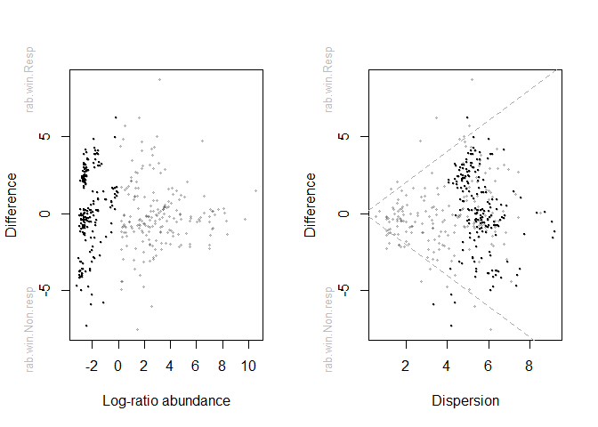
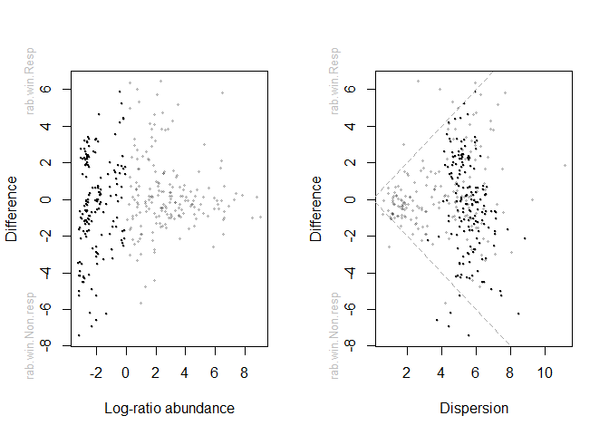
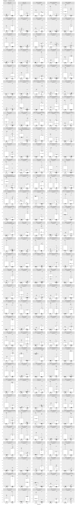
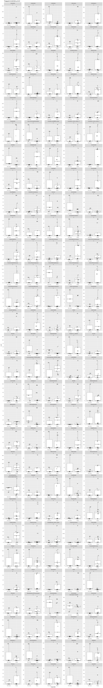
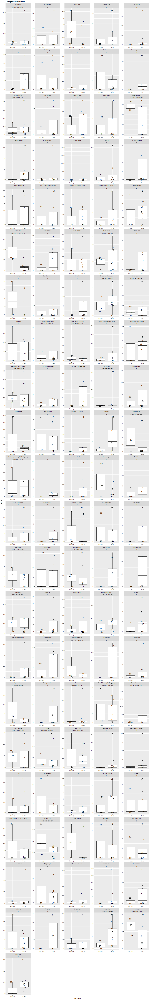
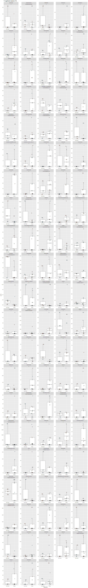
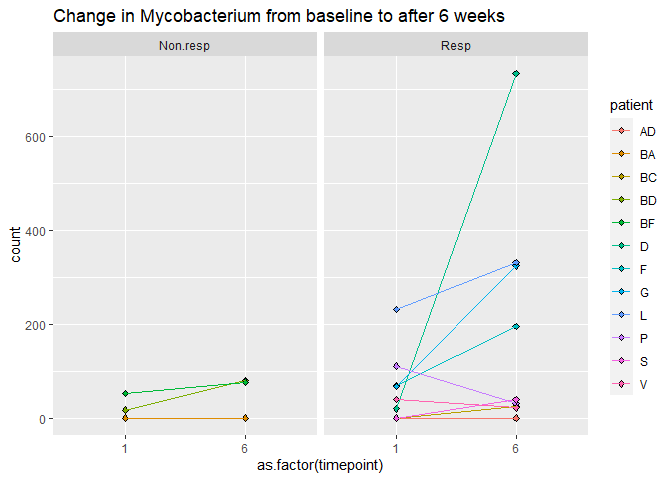
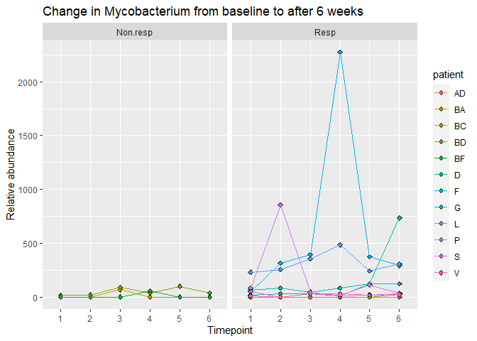

This is based on the tutorial in Orchestrating microbiome analysis (https://microbiome.github.io/OMA/differential-abundance.html).
Read in the needed libraries as well as import data in the right format and make it a Tree Summarized experiment.


```r
knitr::opts_chunk$set(warning = FALSE, message = FALSE) 
```


```r
library(nlme)
library(tidyverse)
library(compositions)
library(mia)
library(patchwork)
library(tidySummarizedExperiment)
library(qiime2R)
library(ANCOMBC)
library(ALDEx2)
library(Maaslin2)
library(knitr)
```

Load in taxonomy(qza) and count file (tsv) and metadata file (txt). (Hidden code, echo = false)


Prepare data and load into a TreeSummarizedExperiment object.

```r
# Add rownames and remove an additional column
rownames(counts) <- counts$OTU_ID
counts$OTU_ID <- NULL

# Add rownames and remove an additional column
rownames(samples) <- samples$id
samples$id <- NULL

# If e.g. samples do not match between colData and counts table, you must order 
# counts based on colData
if( any( colnames(counts) != rownames(samples) ) ){
    counts <- counts[ , rownames(samples) ]
}

# And same with rowData and counts...
if( any( rownames(counts) != rownames(tax) ) ){
    counts <- counts[ rownames(tax), ]
}

counts <- as.matrix(counts)

# And it should be added to a SimpleList
assays <-  SimpleList(counts = counts)

# colData and rowData should be in DataFrame format
colData <- DataFrame(samples)
rowData <- DataFrame(tax)

# Create a TreeSE
tse <- TreeSummarizedExperiment(assays = assays,
                                     colData = samples,
                                     rowData = tax)

tse
```

```
## class: TreeSummarizedExperiment 
## dim: 42212 72 
## metadata(0):
## assays(1): counts
## rownames(42212): 9908fffab7ed4f3bec44cda2f5084d49
##   82dece6e35540738ba450a0c3a90b5a0 ... f8d707e673b73099984f65816c1352b9
##   a992d81dbc470f0ec18ebce00de056af
## rowData names(7): Kingdom Phylum ... Genus Species
## colnames(72): AD01 AD02 ... V05 V06
## colData names(7): concentration volume ... batch timeline
## reducedDimNames(0):
## mainExpName: NULL
## altExpNames(0):
## rowLinks: NULL
## rowTree: NULL
## colLinks: NULL
## colTree: NULL
```

```r
head(getTaxonomyLabels(tse))
```

```
## [1] "Genus:Enterococcus"          "Genus:Serratia"             
## [3] "Genus:Pseudomonas"           "Genus:Escherichia-Shigella" 
## [5] "Genus:Peptoniphilus"         "Species:Lactobacillus_iners"
```

Subsetting to timepoints 1 and 6 to compare patient groups in the first and last timepoint.

```r
#how many observations per group?
count(as.data.frame(colData(tse)), responder) %>% kable()
```


|responder |  n|
|:---------|--:|
|Non.resp  | 18|
|Resp      | 54|

```r
#timepoint 1 and 6 subsetting
tse1 <- tse[ ,colData(tse)$timeline == "1"]
tse6 <- tse[ ,colData(tse)$timeline == "6"]


head(getTaxonomyLabels(tse1))
```

```
## [1] "Genus:Enterococcus"          "Genus:Serratia"             
## [3] "Genus:Pseudomonas"           "Genus:Escherichia-Shigella" 
## [5] "Genus:Peptoniphilus"         "Species:Lactobacillus_iners"
```

```r
#how many observations per group?
count(as.data.frame(colData(tse1)), responder) %>% kable()
```


|responder |  n|
|:---------|--:|
|Non.resp  |  3|
|Resp      |  9|

```r
# set a seed because some tools can randomly vary and then produce 
# different results:
set.seed(1)

#Prevalence filtering  - removing any ASVs found in fewer than 25% of samples, higher threshold because of very low number of samples.
tse <- subsetByPrevalentTaxa(tse, detection = 0, prevalence = 0.25)
tse1 <- subsetByPrevalentTaxa(tse1, detection = 0, prevalence = 0.25)
tse6 <- subsetByPrevalentTaxa(tse6, detection = 0, prevalence = 0.25)

#agglomerate by rank for which you want to do differential abundance testing
tse_genus <- agglomerateByRank(tse, "Genus")
tse1_genus <- agglomerateByRank(tse1, "Genus")
tse6_genus <- agglomerateByRank(tse6, "Genus")
```

Now performing differential aboundance analysis. I will use three methods ALDeX2, Ancom-BC and MaaSlin2 for the comaprison (because different methods often produce different results) and compare them. I will use default options for all methods.

ALDEx2

```r
# T1

x <- aldex.clr(
  reads = assay(tse1_genus),
  conds = colData(tse1_genus)$responder, 
  # 128 recommened for ttest, 1000 for rigorous effect size calculation
  mc.samples = 128, 
  denom = "all",
  verbose = FALSE
)
# calculates expected values of the Welch's t-test and Wilcoxon rank test on
# the data returned by aldex.clr
x_tt <- aldex.ttest(
  x, 
  paired.test = FALSE, 
  verbose = FALSE)
# determines the median clr abundance of the feature in all samples and in
# groups, the median difference between the two groups, the median variation
# within each group and the effect size, which is the median of the ratio
# of the between group difference and the larger of the variance within groups
x_effect <- aldex.effect(x, CI = TRUE, verbose = FALSE)
# combine all outputs 
aldex_out1 <- data.frame(x_tt, x_effect)

#creating an MA plot
par(mfrow = c(1, 2))
aldex.plot(
    aldex_out1, 
    type = "MA", 
    test = "welch", 
    xlab = "Log-ratio abundance",
    ylab = "Difference",
    cutoff = 0.05
  )
aldex.plot(
    aldex_out1, 
    type = "MW", 
    test = "welch",
    xlab = "Dispersion",
    ylab = "Difference",
    cutoff = 0.05
  )
```

<!-- -->

```r
rownames_to_column(aldex_out1, "genus") %>%
  filter(wi.eBH <= 0.05)  %>% # here we chose the wilcoxon output rather than tt
  dplyr::select(genus, we.eBH, wi.eBH, effect, overlap) %>%
  kable()
```


|genus | we.eBH| wi.eBH| effect| overlap|
|:-----|------:|------:|------:|-------:|

```r
# T6

x <- aldex.clr(
  reads = assay(tse6_genus),
  conds = colData(tse6_genus)$responder, 
  # 128 recommened for ttest, 1000 for rigorous effect size calculation
  mc.samples = 128, 
  denom = "all",
  verbose = FALSE
)
# calculates expected values of the Welch's t-test and Wilcoxon rank test on
# the data returned by aldex.clr
x_tt <- aldex.ttest(
  x, 
  paired.test = FALSE, 
  verbose = FALSE)
# determines the median clr abundance of the feature in all samples and in
# groups, the median difference between the two groups, the median variation
# within each group and the effect size, which is the median of the ratio
# of the between group difference and the larger of the variance within groups
x_effect <- aldex.effect(x, CI = TRUE, verbose = FALSE)
# combine all outputs 
aldex_out6 <- data.frame(x_tt, x_effect)

#creating an MA plot
par(mfrow = c(1, 2))
aldex.plot(
    aldex_out6, 
    type = "MA", 
    test = "welch", 
    xlab = "Log-ratio abundance",
    ylab = "Difference",
    cutoff = 0.05
  )
aldex.plot(
    aldex_out6, 
    type = "MW", 
    test = "welch",
    xlab = "Dispersion",
    ylab = "Difference",
    cutoff = 0.05
  )
```

<!-- -->

```r
rownames_to_column(aldex_out6, "genus") %>%
  filter(wi.eBH <= 0.05)  %>% # here we chose the wilcoxon output rather than tt
  dplyr::select(genus, we.eBH, wi.eBH, effect, overlap) %>%
  kable()
```


|genus | we.eBH| wi.eBH| effect| overlap|
|:-----|------:|------:|------:|-------:|

There are no significant results in timepoint 1 or 6 using Aldex2.

ANCOM-BC

```r
# T1
# currently, ancombc requires the phyloseq format, but we can easily convert:

pseq <- makePhyloseqFromTreeSummarizedExperiment(tse1_genus)

# perform the analysis 

out1 = ancombc(
  phyloseq = pseq, 
  formula = "responder", 
  p_adj_method = "fdr", 
  prv_cut = 0, # no prev filtering necessary anymore 
  lib_cut = 0, 
  group = "responder", 
  struc_zero = TRUE, 
  neg_lb = TRUE, 
  tol = 1e-5, 
  max_iter = 100, 
  conserve = TRUE, 
  alpha = 0.05,
  global = TRUE
)

#Warning - results unstable for group <5
#getting the q values (padj values) and the TRUE and FALSE status

q1 <- cbind(out1$res$q_val,out1$res$diff_abn)


# T6

pseq <- makePhyloseqFromTreeSummarizedExperiment(tse6_genus)

# perform the analysis 

out6 = ancombc(
  phyloseq = pseq, 
  formula = "responder", 
  p_adj_method = "fdr", 
  prv_cut = 0, # no prev filtering necessary anymore 
  lib_cut = 0, 
  group = "responder", 
  struc_zero = TRUE, 
  neg_lb = TRUE, 
  tol = 1e-5, 
  max_iter = 100, 
  conserve = TRUE, 
  alpha = 0.05,
  global = TRUE
)

#Warning - results unstable for group <5
#getting the q values (padj values)

q6 <- out6$res$q_val
```

MAASLIN2 - output figs are in separate folder

```r
# T1

# maaslin expects features as columns and samples as rows 
# for both the asv/otu table as well as meta data 

asv <- t(assay(tse1_genus))
meta_data <- data.frame(colData(tse1_genus))

#performing the analysis, default settings:

fit_data1 <- Maaslin2(
  asv,
  meta_data,
  output = "Maaslin2 results Timepoint1",
  transform = "AST",
  fixed_effects = "responder",
  # random_effects = c(...), # you can also fit MLM by specifying random effects
  # specifying a ref is especially important if you have more than 2 levels
  reference = "responder,responder",  
  normalization = "TSS",
  standardize = FALSE,
  min_prevalence = 0 # prev filtering already done
)
```

```
...
## 2022-07-07 11:58:32 INFO::Fitting model to feature number 6, Genus.Lactobacillus
## 2022-07-07 11:58:32 INFO::Fitting model to feature number 31, Genus.Negativicoccus
...
```

```
...
NA
NA
...
```

```
...
NA
NA
...
```

```
...
NA
NA
...
```

```
...
NA
NA
...
```

```
...
NA
NA
...
```

```r
# which genera have q value under 0.15 in timepoint 1?

kable(head(filter(fit_data1$results, qval <= 0.15)))
```


|feature                             |metadata  |value |       coef|    stderr|      pval|name          |      qval|  N| N.not.zero|
|:-----------------------------------|:---------|:-----|----------:|---------:|---------:|:-------------|---------:|--:|----------:|
|Genus.Enhydrobacter                 |responder |Resp  | -0.1060182| 0.0218845| 0.0006770|responderResp | 0.1192477| 12|         12|
|Genus.Salipaludibacillus            |responder |Resp  | -0.0359595| 0.0079880| 0.0011401|responderResp | 0.1192477| 12|         12|
|Genus.Lachnospiraceae_NK4A136_group |responder |Resp  | -0.0281891| 0.0060014| 0.0008453|responderResp | 0.1192477| 12|         12|
|Genus.Collinsella                   |responder |Resp  | -0.0234113| 0.0054203| 0.0015151|responderResp | 0.1192477| 12|          8|
|Genus.Legionella                    |responder |Resp  | -0.0202981| 0.0047239| 0.0015690|responderResp | 0.1192477| 12|          5|

```r
# T6

# maaslin expects features as columns and samples as rows 
# for both the asv/otu table as well as meta data 

asv <- t(assay(tse6_genus))
meta_data <- data.frame(colData(tse6_genus))

#performing the analysis, default settings:

fit_data6 <- Maaslin2(
  asv,
  meta_data,
  output = "Maaslin2 results Timepoint6", # here the results will be stored
  transform = "AST",
  fixed_effects = "responder",
  # random_effects = c(...), # you can also fit MLM by specifying random effects
  # specifying a ref is especially important if you have more than 2 levels
  reference = "responder,responder",  
  normalization = "TSS",
  standardize = FALSE,
  min_prevalence = 0 # prev filtering already done
  )
```

```
...
## 2022-07-07 11:58:38 INFO::Fitting model to feature number 6, Genus.Lactobacillus
## 2022-07-07 11:58:38 INFO::Fitting model to feature number 31, Genus.Negativicoccus
...
```

```r
# which genera have q value under 0.15 in timepoint 6?
kable(head(filter(fit_data6$results, qval <= 0.15)))
```


|feature                           |metadata  |value |      coef|   stderr|      pval|name          |     qval|  N| N.not.zero|
|:---------------------------------|:---------|:-----|---------:|--------:|---------:|:-------------|--------:|--:|----------:|
|Genus..Eubacterium._eligens_group |responder |Resp  | 0.0241504| 0.004293| 0.0002198|responderResp | 0.077793| 12|          9|


COMPARISON RESULTS FROM THE THREE METHODS

```r
# T1

#I am removing all special charachers because the three methods produce Genus names with slight differences in them

aldex_out1 <- aldex_out1 %>% rownames_to_column("genus")
aldex_out1$genus <- gsub("[[:punct:]]", "",aldex_out1$genus)
out1$res$diff_abn <- out1$res$diff_abn %>%  rownames_to_column("genus")
out1$res$diff_abn$genus <- gsub("[[:punct:]]", "",out1$res$diff_abn$genus)
fit_data1$results$feature <- gsub("[[:punct:]]", "",fit_data1$results$feature)

#making a summary table
summ1 <- full_join(
              dplyr::select(aldex_out1, genus, aldex2 = wi.eBH),
              dplyr::select(out1$res$diff_abn, genus, ancombc = responderResp),
              by = "genus") %>%
        full_join(
              dplyr::select(fit_data1$results, genus = feature, maaslin2 = qval), 
              by = "genus") %>%
        mutate(
          across(c(aldex2, ancombc, maaslin2), ~ .x <= 0.1),
          # the following line would be necessary without prevalence filtering 
          # as some methods output NA
          #across(-genus, function(x) ifelse(is.na(x), FALSE, x)),
          score = rowSums(across(c(aldex2, ancombc, maaslin2)),na.rm = TRUE)
        )

#Inspect NAs if needed
#inspect_na <- summ1[rowSums(is.na(summ1)) > 0,]
#View(inspect_na)


# This is how it looks like:
kable(head(summ1))
```


|genus                    |aldex2 |ancombc |maaslin2 | score|
|:------------------------|:------|:-------|:--------|-----:|
|GenusEnterococcus        |FALSE  |TRUE    |FALSE    |     1|
|GenusSerratia            |FALSE  |TRUE    |FALSE    |     1|
|GenusPseudomonas         |FALSE  |TRUE    |FALSE    |     1|
|GenusEscherichiaShigella |FALSE  |TRUE    |FALSE    |     1|
|GenusPeptoniphilus       |FALSE  |TRUE    |FALSE    |     1|
|GenusLactobacillus       |FALSE  |TRUE    |FALSE    |     1|

```r
# how many genera were identified by each method?
summarise(summ1, across(where(is.logical), sum)) %>%
  kable()
```


| aldex2| ancombc| maaslin2|
|------:|-------:|--------:|
|      0|     166|       NA|

```r
# which genera are identified by all methods?
filter(summ1, score == 3) %>% kable()
```


|genus |aldex2 |ancombc |maaslin2 | score|
|:-----|:------|:-------|:--------|-----:|

```r
# which genera are identified by 2 methods?
filter(summ1, score == 2) %>% kable()
```


|genus |aldex2 |ancombc |maaslin2 | score|
|:-----|:------|:-------|:--------|-----:|

```r
# T6
aldex_out6 <- aldex_out6 %>% rownames_to_column("genus")
aldex_out6$genus <- gsub("[[:punct:]]", "",aldex_out6$genus)
out6$res$diff_abn <- out6$res$diff_abn %>%  rownames_to_column("genus")
out6$res$diff_abn$genus <- gsub("[[:punct:]]", "",out6$res$diff_abn$genus)
fit_data6$results$feature <- gsub("[[:punct:]]", "",fit_data6$results$feature)

summ6 <- full_join(
              dplyr::select(aldex_out6, genus, aldex2 = wi.eBH),
              dplyr::select(out6$res$diff_abn, genus, ancombc = responderResp),
              by = "genus") %>%
        full_join(
              dplyr::select(fit_data6$results, genus = feature, maaslin2 = qval), 
              by = "genus") %>%
        mutate(
          across(c(aldex2, ancombc, maaslin2), ~ .x <= 0.1),
          # the following line would be necessary without prevalence filtering 
          # as some methods output NA
          #across(-genus, function(x) ifelse(is.na(x), FALSE, x)),
          score = rowSums(across(c(aldex2, ancombc, maaslin2)),na.rm = TRUE)
        )

#Inspect NAs if needed
#inspect_na <- summ6[rowSums(is.na(summ6)) > 0,]
#View(inspect_na)


# This is how it looks like:
kable(head(summ6))
```


|genus                    |aldex2 |ancombc |maaslin2 | score|
|:------------------------|:------|:-------|:--------|-----:|
|GenusEnterococcus        |FALSE  |TRUE    |FALSE    |     1|
|GenusSerratia            |FALSE  |TRUE    |FALSE    |     1|
|GenusPseudomonas         |FALSE  |TRUE    |FALSE    |     1|
|GenusEscherichiaShigella |FALSE  |TRUE    |FALSE    |     1|
|GenusPeptoniphilus       |FALSE  |TRUE    |FALSE    |     1|
|GenusLactobacillus       |FALSE  |TRUE    |FALSE    |     1|

```r
# how many genera were identified by each method?
summarise(summ6, across(where(is.logical), sum)) %>%
  kable()
```


| aldex2| ancombc| maaslin2|
|------:|-------:|--------:|
|      0|     171|       NA|

```r
# which genera are identified by all methods?
filter(summ6, score == 3) %>% kable()
```


|genus |aldex2 |ancombc |maaslin2 | score|
|:-----|:------|:-------|:--------|-----:|

```r
# which genera are identified by 2 methods?
filter(summ6, score == 2) %>% kable()
```


|genus |aldex2 |ancombc |maaslin2 | score|
|:-----|:------|:-------|:--------|-----:|

ANCOM-BC showed some significant results. Plotting here relative abundances of significant Genera in timepoint 1 and timepoint 6 results.

```r
# T1

#getting the relative aboundances from counts

tse1_genus_RA <- transformCounts(tse1_genus,
                              abund_values = "counts",
                               method = "relabundance")
tse6_genus_RA <- transformCounts(tse6_genus,
                              abund_values = "counts",
                              method = "relabundance")
tse_genus_RA <- transformCounts(tse_genus,
                              abund_values = "counts",
                              method = "relabundance")

                             
plot_data1 <- data.frame(t(assay(tse1_genus_RA)))
plot_data1$responder <- colData(tse1_genus_RA)$responder
plot_data1$patient <- colData(tse1_genus_RA)$patient
plot_data1 <- plot_data1 %>% rownames_to_column("sample")
names <- names(plot_data1)
first <- names[2]
last <- names[length(names)-2] #jer su zadnja dva reda responder i patient
plot_data1 <- gather(plot_data1, genus, count, all_of(first):all_of(last), factor_key=TRUE)
plot_data1 <- dplyr::bind_cols(plot_data1, summ=summ1$score[match(plot_data1$genus, summ1$genus)])
q1 <- q1 %>% rownames_to_column("genus")
q1$genus <- gsub("\\:", "\\.",q1$genus) 
plot_data1 <- dplyr::bind_cols(plot_data1, q_ancom=q1$responderResp[match(plot_data1$genus, q1$genus)])
plot_data1$genus <- gsub("Genus.", "",plot_data1$genus)

data = subset(plot_data1, plot_data1$q_ancom <= 0.01)

#PLOTTING TIMEPOINT 1 RESULTS

plot <- ggplot(data, aes(x = responder, y= count)) +
              geom_boxplot() +
              geom_text(aes(label = patient), size = 4, 
                          position =    position_jitter(width = 0.1))  +
              facet_wrap(~genus + q_ancom, scales = "free", ncol = 5, labeller =               label_both) +
              ggtitle("Timepoint 1 ANCOM q<0.01")

plot
```

<!-- -->

```r
# T6

plot_data6 <- data.frame(t(assay(tse6_genus_RA)))
plot_data6$responder <- colData(tse6_genus_RA)$responder
plot_data6$patient <- colData(tse6_genus_RA)$patient
plot_data6 <- plot_data6 %>% rownames_to_column("sample")
names <- names(plot_data6)
first <- names[2]
last <- names[length(names)-2]
plot_data6 <- gather(plot_data6, genus, count, all_of(first):all_of(last), factor_key=TRUE)
plot_data6 <- dplyr::bind_cols(plot_data6, summ=summ6$score[match(plot_data6$genus, summ6$genus)])
q6 <- q6 %>% rownames_to_column("genus")
q6$genus <- gsub("\\:", "\\.",q6$genus)

#PLOTTING TIMEPOINT 6 RESULTS

plot_data6 <- dplyr::bind_cols(plot_data6, q_ancom=q6$responderResp[match(plot_data6$genus, q6$genus)])
plot_data6$genus <- gsub("Genus.", "",plot_data6$genus)

data = subset(plot_data6, plot_data6$q_ancom <= 0.01)


plot <- ggplot(data, aes(x = responder, y= count)) + 
                geom_boxplot()  + 
                geom_text(aes(label = patient), size = 4, position = position_jitter(width = 0.1)) + 
                facet_wrap(~genus + q_ancom, scales = "free", ncol = 5) + 
                ggtitle("Timepoint 6 ANCOM q<0.01")
plot
```

<!-- -->


COMPARISON OF TIMEPOINTS

```r
#T1 vs T6

plot_data_1vs6 <- full_join(
              dplyr::select(plot_data1, patient, genus, responder, t1_count = count, t1_q_ancom = q_ancom),
              dplyr::select(plot_data6, patient, genus, responder, t6_count = count, t6_q_ancom = q_ancom),
              by = c("patient", "genus", "responder"))


#setting a more loose threshold of q value = 0.1 to see if some bacteria are DA in both timepoints
data = subset(plot_data_1vs6, plot_data_1vs6$q1_ancom <= 0.1 & plot_data_1vs6$q6_ancom <= 0.1)


#komentirati ispred plot ako ovo prazan podskup pa daje grešku: (kad nema značajnih u jednom i drugom)
plot <- ggplot(data, aes(x = responder, y= t1_count)) + geom_boxplot() + geom_jitter() + facet_wrap(~genus, scales = "free") + ggtitle("Both timepoints q_value < 0.1")
#plot

#T6 significant genera in T1
data6 = subset(plot_data6, plot_data6$q_ancom <= 0.01)

data = subset(plot_data1, plot_data1$genus %in% data6$genus)

plot <- ggplot(data, aes(x = responder, y= count)) + 
                geom_boxplot()  + 
                geom_text(aes(label = patient), size = 4, position = position_jitter(width = 0.1)) + 
                facet_wrap(~genus + q_ancom, scales = "free", ncol = 5) + 
                ggtitle("T6 significant results in T1")
plot
```

<!-- -->

```r
#T1 significant genera in T6
data1 = subset(plot_data1, plot_data1$q_ancom <= 0.01)

data = subset(plot_data6, plot_data6$genus %in% data1$genus)

plot <- ggplot(data, aes(x = responder, y= count)) + 
                geom_boxplot(outlier.colour = NA) + 
                geom_text(aes(label = patient), size = 4, position = position_jitter(width = 0.1)) + 
                facet_wrap(~genus + q_ancom, scales = "free", ncol = 5) + 
                ggtitle("T1 significant results in T6")
plot
```

<!-- -->

No significant genera in both timepoint 1 and timepoint 6.


```r
#Mycobacterium 1 vs 6

data = subset(plot_data_1vs6, genus == "Mycobacterium")
data1 = data[1:5]
data6 = data[-c(4:5)]
data1$timepoint = 1
data6$timepoint = 6
data1$count = data1$t1_count
data6$count = data6$t6_count
data1$q_val = data1$t1_q_ancom
data6$q_val = data6$t6_q_ancom
data1 =dplyr::select(data1, patient, genus, responder, timepoint, count, q_val)
data6 =dplyr::select(data6, patient, genus, responder, timepoint, count, q_val)
data= rbind(data1,data6)

plot <- ggplot(data, aes(x = as.factor(timepoint) , y= count)) +
  #geom_boxplot() + 
  geom_point(pch=23, aes(fill = patient)) +
  geom_line(aes(group = patient, color = patient)) +
  facet_wrap(~responder, ncol = 5) + 
  ggtitle("Change in Mycobacterium from baseline to after 6 weeks")
plot
```

<!-- -->

```r
# T1:6 Mycobacterium change
plot_data <- data.frame(t(assay(tse_genus_RA)))
plot_data$responder <- colData(tse_genus_RA)$responder
plot_data$patient <- colData(tse_genus_RA)$patient
plot_data$timeline <- colData(tse_genus)$timeline
plot_data <- plot_data %>% rownames_to_column("sample")
names <- names(plot_data)
first <- names[2]
last <- names[length(names)-3] # responder, patient, timeline
plot_data <- gather(plot_data, genus, count, first:last, factor_key=TRUE)
plot_data$genus <- gsub("Genus.", "",plot_data$genus)

data = subset(plot_data, genus == "Mycobacterium")


plot <- ggplot(data, aes(x = as.factor(timeline) , y= count)) +
  #geom_boxplot() + 
  geom_point(pch=23, aes(fill = patient)) +
  geom_line(aes(group = patient, color = patient)) +
  facet_wrap(~responder, ncol = 5) + 
  ggtitle("Change in Mycobacterium from baseline to after 6 weeks") +
  ylab("Relative abundance") +
  xlab("Timepoint")
plot
```

<!-- -->

